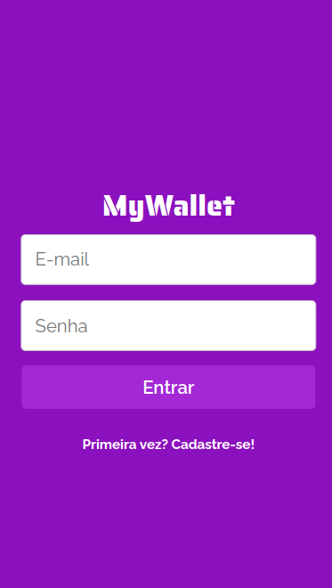
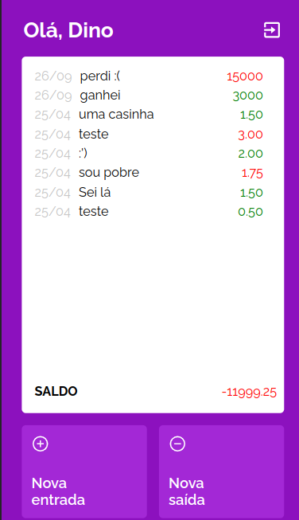

# My Wallet

My Wallet is here to provide a simple, yet effective tool in order to keep your personal finances in check. You can easily register your incomes and outcomes, seeing a color sensitive response to each new data.

## Table of Contents

- [Overview](#overview)
- [Badges](#badges)
- [Getting Started](#getting-started)
  - [Prerequisites](#prerequisites)
  - [Installation](#installation)
- [Usage](#usage)

## Overview


Have you ever had trouble keeping your personal finances in check? Well, My Wallet is here to help you solve this issue.

Developed in React and NodeJS, My Wallet is a fullstack website where you can easily list all your expenses and gains and it will provide you with a color sensitive response on each registry and the general income.

## Badges

This project was developed using the following technologies


## Getting Started

Here's to running the project locally :rocket:

### Prerequisites

You'll need an npm to run the project. If you don't have a package in your machine, globally install it by entering the following command on your terminal

```bash
    npm install npm@latest -g
```
### Installation

Start installing the project to run it locally by following the instructions below:

1. Clone this repository
```bash
    git clone https://github.com/ohanaace/mywallet-front.git
```

2. Run the install command to install all dependencies on the project's folder terminal
```bash
    npm install
```

3. Clone the backend repository
```bash
    git clone https://github.com/ohanaace/mywallet-back.git
```

4. Run the install command to install all dependencies on the backend terminal
```bash
    npm install
```
5. On the **frontend** repository, create a ``.env`` file and adjust it according to the ``.env.example`` file, referencing the PORT backend will run on. Alternatively, you can use the backend deploy [here](https://my-wallet-api-zbtv.onrender.com)

6. On the **backend** repository,  create a ``.env`` file and adjust it according to the ``.env.example`` file

1. On the **frontend** repository, run
```bash
    npm start
```

Application will run on ``localhost:3000``

## Usage
 

Or, if you prefer, you can also try the deployed version [here](https://projeto14-mywallet-front-sand.vercel.app/)
